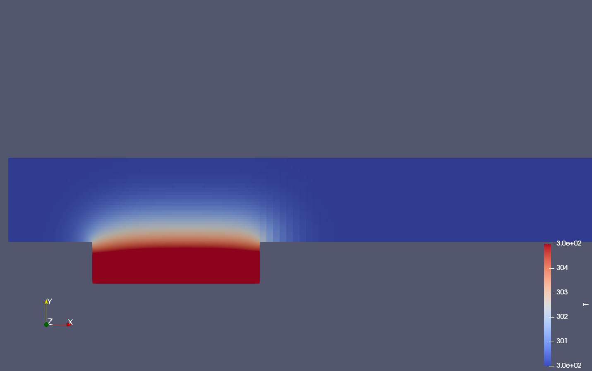
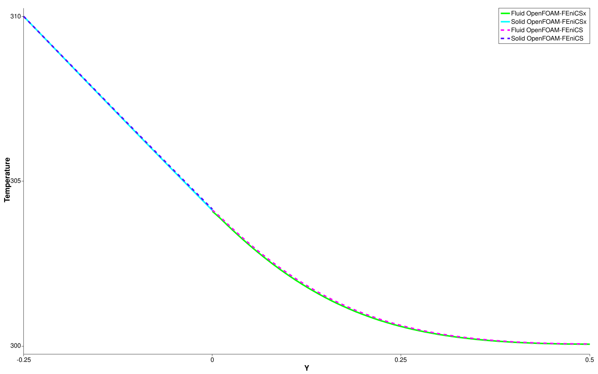

## General information

The full description with all general information about this tutorial can be taken from the `precice/tutorials/flow-over-heated-plate` repository.

## Running the Simulation

All listed solvers can be used in order to run the simulation. Open two separate terminals and start the FEniCSx solver and OpenFOAM solver by running

```bash
cd fluid-openfoam
./run.sh
```

and

```bash
cd solid-fenicsx
python3 solid.py
```

## Results

Paraview output at `t=1.0`:


Comparison between FEniCS-OpenFOAM and FEniCSx-OpenFOAM of the temperature along `x=0.5`:

